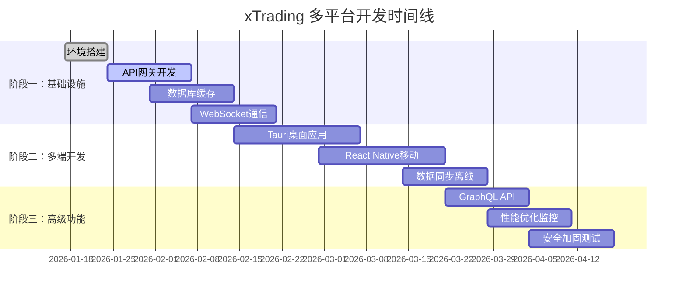

# xTrading 多平台量化交易系统开发计划

## 📋 项目概述

### 项目目标
将xTrading从单一后端系统演进为支持多平台（桌面端、移动端、Web端）的企业级量化交易解决方案。

### 技术架构
- **后端**: Python 3.9+ + FastAPI + MySQL + Redis + MyQuant SDK
- **桌面端**: Tauri 2 + React 18 + TypeScript + Tailwind CSS
- **移动端**: React Native + TypeScript + Zustand
- **API网关**: JWT + OAuth2 + WebSocket + GraphQL
- **部署**: Docker + Kubernetes + Prometheus + Grafana

### 核心特性
- ✅ 现有：Python后端 + 回测引擎 + 策略框架
- 🔄 新增：Tauri桌面应用、React Native移动应用
- 🔄 新增：统一API网关、WebSocket实时通信
- 🔄 新增：多级缓存、数据同步、离线支持
- 🔄 新增：GraphQL API、GraphQL查询优化

---

## 🎯 开发阶段规划

### 阶段一：核心基础设施建设 (4-6周)

#### 第1周：环境搭建与基础配置
**目标**: 建立开发环境，统一技术栈和工具链

**任务清单**:
- [ ] 1.1 配置Python开发环境 (Python 3.9+, pip/uv)
- [ ] 1.2 配置Node.js环境 (Node 18+, npm/yarn)
- [ ] 1.3 配置Rust环境 (Rust 1.75+, Cargo)
- [ ] 1.4 安装Tauri CLI和依赖
- [ ] 1.5 设置Git Hooks和Pre-commit
- [ ] 1.6 配置Docker开发环境
- [ ] 1.7 初始化项目目录结构

**交付物**:
- ✅ 开发环境配置文档
- ✅ 项目脚手架代码
- ✅ Docker开发环境
- ✅ Pre-commit钩子配置

**验收标准**:
- 所有工具链安装完成
- 本地开发环境可正常启动
- 代码规范检查通过
- 单元测试可运行

#### 第2-3周：API网关与认证系统
**目标**: 构建统一的API网关，实现JWT认证和OAuth2授权

**任务清单**:
- [ ] 2.1 设计并实现FastAPI网关中间件
- [ ] 2.2 实现JWT Token生成与验证
- [ ] 2.3 实现OAuth2授权流程
- [ ] 2.4 实现用户认证API (注册/登录/登出)
- [ ] 2.5 实现权限管理中间件
- [ ] 2.6 实现API限流与熔断机制
- [ ] 2.7 添加CORS和安全头中间件

**技术要点**:
- 使用FastAPI + PyJWT实现认证
- 集成Redis存储Token黑名单
- 实现基于角色的访问控制(RBAC)
- 添加API调用频率限制

**交付物**:
- ✅ API网关源码
- ✅ 认证授权系统
- ✅ API文档 (OpenAPI/Swagger)
- ✅ 单元测试和集成测试

**验收标准**:
- JWT Token生成与验证正确
- OAuth2流程完整可用
- API限流生效
- 安全测试通过

#### 第4-5周：数据库与缓存层
**目标**: 完善数据存储和缓存系统，实现多级缓存策略

**任务清单**:
- [ ] 4.1 设计数据库表结构 (用户、策略、回测结果)
- [ ] 4.2 实现SQLAlchemy模型和迁移
- [ ] 4.3 配置MySQL主从复制
- [ ] 4.4 集成Redis作为二级缓存
- [ ] 4.5 实现三级缓存系统 (内存→Redis→MySQL)
- [ ] 4.6 实现数据同步机制
- [ ] 4.7 实现缓存失效策略

**技术要点**:
- 使用Alembic进行数据库版本管理
- 实现读写分离架构
- 使用Redis实现分布式锁
- 实现缓存预热和主动刷新

**交付物**:
- ✅ 数据库模型和迁移脚本
- ✅ 缓存管理器源码
- ✅ 数据库性能优化
- ✅ 缓存测试报告

**验收标准**:
- 数据库连接稳定
- 缓存命中率 > 80%
- 数据一致性保证
- 性能测试达标

#### 第6周：WebSocket实时通信
**目标**: 实现实时数据推送和WebSocket连接管理

**任务清单**:
- [ ] 6.1 设计WebSocket消息协议
- [ ] 6.2 实现连接管理器 (连接池、健康检查)
- [ ] 6.3 实现行情数据实时推送
- [ ] 6.4 实现交易信号实时通知
- [ ] 6.5 实现断线重连机制
- [ ] 6.6 实现消息广播和订阅
- [ ] 6.7 添加WebSocket监控指标

**技术要点**:
- 使用FastAPI WebSocket + Redis Pub/Sub
- 实现心跳检测和自动重连
- 使用消息队列保证消息可靠性
- 添加连接数和带宽监控

**交付物**:
- ✅ WebSocket服务器
- ✅ 实时消息系统
- ✅ 连接管理模块
- ✅ 监控仪表板

**验收标准**:
- 支持500+并发连接
- 消息延迟 < 100ms
- 断线重连成功
- 消息不丢失

---

### 阶段二：多端应用开发 (6-8周)

#### 第7-9周：Tauri桌面应用开发
**目标**: 构建专业级桌面交易应用

**任务清单**:
- [ ] 7.1 初始化Tauri项目和基础配置
- [ ] 7.2 实现主界面布局和导航
- [ ] 7.3 实现仪表板页面 (资产概览、收益图表)
- [ ] 7.4 实现行情监控页面 (实时行情、涨跌幅排行)
- [ ] 7.5 实现回测管理页面 (创建、查看、删除回测)
- [ ] 7.6 实现策略管理页面 (策略列表、参数配置)
- [ ] 7.7 实现交易信号页面 (信号列表、信号详情)
- [ ] 7.8 实现风险管理页面 (风险指标、预警设置)
- [ ] 7.9 实现报告页面 (绩效报告、交易明细)

**技术要点**:
- React 18 + TypeScript开发
- Zustand状态管理
- shadcn/ui组件库
- Recharts图表库
- Tauri Rust后端集成

**交付物**:
- ✅ 桌面应用源码
- ✅ Rust后端模块
- ✅ UI组件库
- ✅ 应用图标和资源

**验收标准**:
- 应用可正常启动和运行
- 所有页面可正常访问
- 实时数据正常更新
- 桌面集成功能正常

#### 第10-12周：React Native移动应用
**目标**: 开发轻量级移动监控应用

**任务清单**:
- [ ] 10.1 初始化React Native项目
- [ ] 10.2 实现导航结构和基础页面
- [ ] 10.3 实现资产概览页面
- [ ] 10.4 实现持仓管理页面
- [ ] 10.5 实现收益监控页面
- [ ] 10.6 实现交易信号推送
- [ ] 10.7 实现离线数据缓存
- [ ] 10.8 实现数据同步功能
- [ ] 10.9 添加推送通知功能

**技术要点**:
- React Native 0.72+
- React Navigation 6
- Zustand状态管理
- SQLite本地存储
- React Native Push Notification

**交付物**:
- ✅ 移动应用源码
- ✅ 离线数据管理
- ✅ 推送通知系统
- ✅ 跨平台适配

**验收标准**:
- iOS和Android平台可运行
- 离线模式正常工作
- 推送通知及时到达
- 数据同步准确

#### 第13-14周：数据同步与离线支持
**目标**: 实现多平台数据一致性和离线功能

**任务清单**:
- [ ] 13.1 设计数据同步协议
- [ ] 13.2 实现增量数据同步
- [ ] 13.3 实现离线队列管理
- [ ] 13.4 实现数据冲突检测和解决
- [ ] 13.5 实现版本控制系统
- [ ] 13.6 实现智能合并算法
- [ ] 13.7 添加同步状态指示器

**技术要点**:
- 使用操作日志(Operational Log)记录变更
- 实现向量时钟(Vector Clock)解决冲突
- 使用CRDTs (无冲突复制数据类型)
- 实现指数退避重试策略

**交付物**:
- ✅ 数据同步引擎
- ✅ 冲突解决算法
- ✅ 版本控制系统
- ✅ 离线队列管理

**验收标准**:
- 数据同步延迟 < 5秒
- 冲突解决正确
- 离线操作无丢失
- 同步状态可追踪

---

### 阶段三：高级功能与优化 (4-6周)

#### 第15-16周：GraphQL API开发
**目标**: 提供灵活的查询接口，优化移动端数据获取

**任务清单**:
- [ ] 15.1 设计GraphQL Schema
- [ ] 15.2 实现GraphQL查询解析器
- [ ] 15.3 实现N+1查询优化 (DataLoader)
- [ ] 15.4 实现查询缓存机制
- [ ] 15.5 实现订阅功能 (实时数据)
- [ ] 15.6 添加GraphQL Playground
- [ ] 15.7 实现查询性能监控

**技术要点**:
- 使用Strawberry GraphQL
- 实现DataLoader批处理
- 使用Redis缓存查询结果
- 添加查询复杂度限制

**交付物**:
- ✅ GraphQL API服务
- ✅ Schema定义文档
- ✅ 性能优化方案
- ✅ GraphQL客户端库

**验收标准**:
- 查询响应时间 < 200ms
- N+1问题解决
- 缓存命中率 > 70%
- 支持实时订阅

#### 第17-18周：性能优化与监控
**目标**: 系统性能调优，建立完善的监控体系

**任务清单**:
- [ ] 17.1 实现API性能优化 (连接池、查询优化)
- [ ] 17.2 实现前端性能优化 (代码分割、懒加载)
- [ ] 17.3 实现移动端性能优化 (图片压缩、列表虚拟化)
- [ ] 17.4 集成Prometheus监控
- [ ] 17.5 配置Grafana仪表板
- [ ] 17.6 实现日志聚合 (ELK Stack)
- [ ] 17.7 添加告警系统

**技术要点**:
- 使用Redis连接池
- 实现查询结果分页
- 前端使用React.lazy和Suspense
- 移动端实现列表虚拟化

**交付物**:
- ✅ 性能优化报告
- ✅ 监控仪表板
- ✅ 日志分析系统
- ✅ 告警规则配置

**验收标准**:
- API P95响应时间 < 200ms
- 前端首屏加载 < 3秒
- 移动端滑动流畅 (60fps)
- 监控告警正常

#### 第19-20周：安全加固与渗透测试
**目标**: 系统安全审计，修复安全漏洞

**任务清单**:
- [ ] 19.1 进行安全代码审查
- [ ] 19.2 实现API接口加密 (HTTPS/TLS 1.3)
- [ ] 19.3 实现数据加密存储
- [ ] 19.4 添加SQL注入防护
- [ ] 19.5 添加XSS攻击防护
- [ ] 19.6 实现CSRF防护
- [ ] 19.7 进行渗透测试
- [ ] 19.8 修复安全问题

**技术要点**:
- 使用Let's Encrypt SSL证书
- 实现字段级数据加密
- 使用参数化查询
- 添加CSP (Content Security Policy)

**交付物**:
- ✅ 安全审计报告
- ✅ 加密方案文档
- ✅ 渗透测试报告
- ✅ 安全修复补丁

**验收标准**:
- 无高危安全漏洞
- 数据传输加密
- 敏感信息脱敏
- 安全测试通过

---

## 📅 项目时间线

---

## 👥 团队配置与资源

### 核心团队 (5-7人)

**技术负责人 (1人)**
- 负责整体架构设计
- 技术选型和决策
- 代码审查和质量控制

**后端开发 (2人)**
- FastAPI API网关开发
- 数据库设计和优化
- 缓存系统实现
- WebSocket服务开发

**前端开发 (2人)**
- Tauri桌面应用开发
- React Native移动应用开发
- UI/UX实现
- 前端性能优化

**DevOps工程师 (1人)**
- CI/CD流水线搭建
- 监控告警系统
- 安全加固
- 部署运维

**测试工程师 (1人)**
- 自动化测试编写
- 性能测试
- 安全测试
- 质量保证

### 技术资源

**开发环境**
- IDE: VS Code + Rust Analyzer + TypeScript支持
- 数据库: MySQL 8.0 + Redis 7.0
- 消息队列: RabbitMQ / Apache Kafka
- 监控: Prometheus + Grafana

**第三方服务**
- CDN: Cloudflare / AWS CloudFront
- SSL证书: Let's Encrypt
- 日志服务: ELK Stack / Loki
- 推送服务: Firebase Cloud Messaging

**硬件资源**
- 开发服务器: 16核CPU, 64GB RAM, SSD存储
- 测试服务器: 8核CPU, 32GB RAM, SSD存储
- 数据库服务器: 32核CPU, 128GB RAM, NVMe SSD

---

## 📊 里程碑与交付物

### 里程碑 1: 基础架构完成 (第6周)
**目标**: API网关、数据库、WebSocket基础服务就绪

**交付物**:
- ✅ API网关服务 (支持JWT认证)
- ✅ MySQL数据库 (用户、策略、回测表)
- ✅ Redis缓存系统
- ✅ WebSocket实时通信
- ✅ 基础监控面板
- ✅ 开发文档

**验收标准**:
- API响应时间 < 200ms
- 支持500并发连接
- 单元测试覆盖率 > 80%
- 安全测试通过

### 里程碑 2: 桌面应用发布 (第9周)
**目标**: Tauri桌面应用完成开发并发布

**交付物**:
- ✅ 桌面应用 v1.0
- ✅ 仪表板、行情、回测、策略页面
- ✅ 实时数据更新
- ✅ 交易信号展示
- ✅ 风险管理页面
- ✅ 用户使用手册

**验收标准**:
- 应用启动时间 < 5秒
- 内存占用 < 500MB
- 所有页面功能正常
- 用户界面友好

### 里程碑 3: 移动应用发布 (第12周)
**目标**: React Native移动应用发布

**交付物**:
- ✅ iOS应用 v1.0
- ✅ Android应用 v1.0
- ✅ 资产概览页面
- ✅ 持仓管理页面
- ✅ 交易信号推送
- ✅ 离线缓存功能

**验收标准**:
- iOS/Android平台兼容
- 推送延迟 < 10秒
- 离线功能正常
- 应用审核通过

### 里程碑 4: 数据同步完成 (第14周)
**目标**: 多平台数据同步和离线支持

**交付物**:
- ✅ 数据同步引擎
- ✅ 冲突解决算法
- ✅ 版本控制系统
- ✅ 离线队列管理
- ✅ 同步监控面板
- ✅ 同步测试报告

**验收标准**:
- 数据同步延迟 < 5秒
- 冲突解决正确率 100%
- 离线操作不丢失
- 同步状态可追踪

### 里程碑 5: GraphQL上线 (第16周)
**目标**: GraphQL API发布

**交付物**:
- ✅ GraphQL API服务
- ✅ Schema文档
- ✅ 性能优化方案
- ✅ GraphQL客户端
- ✅ 查询性能监控
- ✅ 开发者文档

**验收标准**:
- 查询响应时间 < 200ms
- N+1问题完全解决
- 缓存命中率 > 70%
- 实时订阅稳定

### 里程碑 6: 性能优化完成 (第18周)
**目标**: 系统性能达标

**交付物**:
- ✅ 性能优化报告
- ✅ 监控仪表板
- ✅ 日志分析系统
- ✅ 告警规则
- ✅ 性能基线文档
- ✅ 优化建议

**验收标准**:
- API P95 < 200ms
- 前端首屏 < 3秒
- 移动端60fps
- 告警及时准确

### 里程碑 7: 安全审计完成 (第20周)
**目标**: 系统安全合规

**交付物**:
- ✅ 安全审计报告
- ✅ 渗透测试报告
- ✅ 安全修复补丁
- ✅ 安全配置文档
- ✅ 应急响应计划
- ✅ 安全培训材料

**验收标准**:
- 无高危漏洞
- 安全测试通过
- 数据加密完整
- 合规性检查通过

### 里程碑 8: 系统上线 (第20周)
**目标**: 生产环境部署

**交付物**:
- ✅ 生产环境部署
- ✅ 监控系统上线
- ✅ 备份恢复方案
- ✅ 运维文档
- ✅ 用户手册
- ✅ 技术支持

**验收标准**:
- 系统稳定运行
- 监控告警正常
- 备份恢复测试通过
- 用户培训完成

---

## ⚠️ 风险评估与应对

### 技术风险

**风险 1: Tauri框架稳定性**
- **影响**: 桌面应用开发延期
- **概率**: 中等
- **应对**: 提前进行Tauri POC验证，准备备选方案(Electron)

**风险 2: WebSocket高并发性能**
- **影响**: 实时数据推送延迟
- **概率**: 中等
- **应对**: 使用Redis Pub/Sub优化，提前进行压力测试

**风险 3: 跨平台兼容性**
- **影响**: 移动应用适配困难
- **概率**: 高
- **应对**: 使用React Native社区库，充分测试iOS/Android差异

**风险 4: 数据一致性**
- **影响**: 多平台数据不同步
- **概率**: 中等
- **应对**: 实现严格版本控制，添加数据校验机制

### 进度风险

**风险 5: 需求变更**
- **影响**: 开发进度延期
- **概率**: 中等
- **应对**: 采用敏捷开发，迭代交付，冻结核心需求

**风险 6: 团队人员变动**
- **影响**: 项目延期
- **概率**: 低
- **应对**: 知识共享，文档完善，代码审查

### 资源风险

**风险 7: 开发环境资源不足**
- **影响**: 开发效率降低
- **概率**: 低
- **应对**: 云服务器备份，优化开发流程

**风险 8: 第三方服务依赖**
- **影响**: 功能受限
- **概率**: 低
- **应对**: 多云部署，本地备份方案

---

## 📈 成功指标

### 技术指标

**性能指标**
- API响应时间 (P95): < 200ms
- WebSocket连接数: > 500
- 数据库查询时间: < 50ms
- 缓存命中率: > 80%

**质量指标**
- 代码覆盖率: > 80%
- 关键模块覆盖率: > 90%
- 单元测试通过率: 100%
- 集成测试通过率: 100%

**安全指标**
- 安全漏洞: 0个高危
- 认证失败率: < 0.1%
- 数据传输加密: 100%
- 敏感信息脱敏: 100%

### 业务指标

**用户指标**
- 桌面应用DAU: > 100
- 移动应用DAU: > 500
- 用户留存率 (7天): > 60%
- 用户满意度: > 4.5/5

**系统指标**
- 系统可用性: > 99.9%
- 错误率: < 0.1%
- 崩溃率: < 0.01%
- 性能投诉: 0

---

## 💰 预算估算

### 人力成本

**阶段一: 基础设施建设 (6周)**
- 技术负责人: 6周 × 2万元/周 = 12万元
- 后端开发 × 2: 6周 × 1.5万元/人周 × 2人 = 18万元
- DevOps工程师: 6周 × 1.5万元/周 = 9万元
- 测试工程师: 6周 × 1万元/周 = 6万元
- 小计: 45万元

**阶段二: 多端开发 (8周)**
- 技术负责人: 8周 × 2万元/周 = 16万元
- 前端开发 × 2: 8周 × 1.5万元/人周 × 2人 = 24万元
- 后端开发 × 1: 8周 × 1.5万元/周 = 12万元
- 测试工程师: 8周 × 1万元/周 = 8万元
- 小计: 60万元

**阶段三: 高级功能 (6周)**
- 技术负责人: 6周 × 2万元/周 = 12万元
- 后端开发 × 2: 6周 × 1.5万元/人周 × 2人 = 18万元
- DevOps工程师: 6周 × 1.5万元/周 = 9万元
- 测试工程师: 6周 × 1万元/周 = 6万元
- 小计: 45万元

**人力成本总计**: 150万元

### 硬件成本

**开发服务器**: 5台 × 2万元/台 = 10万元
**测试服务器**: 3台 × 1.5万元/台 = 4.5万元
**数据库服务器**: 2台 × 3万元/台 = 6万元
**存储设备**: 5TB × 0.5万元/TB = 2.5万元
**网络设备**: 3万元
**硬件成本小计**: 26万元

### 软件与服务

**云服务器**: 2000元/月 × 20个月 = 4万元
**CDN服务**: 1000元/月 × 20个月 = 2万元
**SSL证书**: 1000元/年 × 2年 = 0.2万元
**第三方API**: 5000元/月 × 20个月 = 10万元
**软件服务小计**: 16.2万元

### 其他成本

**办公设备**: 5万元
**培训费用**: 3万元
**差旅费用**: 2万元
**其他小计**: 10万元

### 预算总计

**总预算**: 150 + 26 + 16.2 + 10 = **202.2万元**

---

## 📚 文档交付清单

### 技术文档
- ✅ 架构设计文档
- ✅ API接口文档
- ✅ 数据库设计文档
- ✅ 部署运维文档
- ✅ 安全审计报告
- ✅ 性能测试报告

### 开发文档
- ✅ 开发环境搭建指南
- ✅ 代码规范文档
- ✅ 测试规范文档
- ✅ Git工作流文档
- ✅ CI/CD流水线文档

### 用户文档
- ✅ 用户使用手册
- ✅ 管理员手册
- ✅ 常见问题解答
- ✅ 视频教程

### 项目管理文档
- ✅ 项目计划书
- ✅ 风险评估报告
- ✅ 进度跟踪报告
- ✅ 验收测试报告

---

## 🎓 培训计划

### 开发团队培训

**第一周: 技术栈培训**
- Python FastAPI框架培训 (8小时)
- TypeScript + React培训 (8小时)
- Tauri开发培训 (8小时)
- React Native开发培训 (8小时)

**第二周: 开发规范培训**
- 代码规范培训 (4小时)
- Git工作流培训 (4小时)
- 测试规范培训 (4小时)
- CI/CD培训 (4小时)

**第三周: 安全培训**
- 安全开发培训 (8小时)
- 渗透测试培训 (8小时)
- 应急响应培训 (4小时)

### 用户培训

**上线前培训**
- 桌面应用使用培训 (4小时)
- 移动应用使用培训 (4小时)
- 常见问题解答 (2小时)

---

## ✅ 验收标准

### 功能验收

**API网关**
- JWT认证功能正常
- API限流生效
- 错误处理完善
- 文档完整准确

**数据库与缓存**
- 数据读写正常
- 缓存命中率达标
- 数据一致性保证
- 性能满足要求

**WebSocket**
- 连接稳定可靠
- 消息实时推送
- 断线重连正常
- 并发性能达标

**桌面应用**
- 所有页面可正常访问
- 实时数据更新正常
- 交易信号展示正确
- 用户体验流畅

**移动应用**
- iOS/Android平台兼容
- 离线功能正常
- 推送通知及时
- 性能表现良好

**数据同步**
- 同步延迟 < 5秒
- 冲突解决正确
- 版本控制准确
- 状态可追踪

**GraphQL API**
- 查询响应快速
- N+1问题解决
- 缓存机制有效
- 实时订阅稳定

### 性能验收

**API性能**
- P95响应时间 < 200ms
- P99响应时间 < 500ms
- 吞吐量 > 1000 QPS
- 并发连接 > 500

**前端性能**
- 首屏加载时间 < 3秒
- 页面切换 < 200ms
- 内存占用合理
- CPU使用率 < 50%

**移动端性能**
- 应用启动 < 3秒
- 列表滚动流畅 (60fps)
- 电池消耗合理
- 网络请求优化

### 安全验收

**代码安全**
- 无高危漏洞
- 无SQL注入
- 无XSS漏洞
- 无CSRF攻击

**数据安全**
- 传输加密 (HTTPS/TLS)
- 存储加密 (敏感字段)
- 访问控制严格
- 审计日志完整

**合规性**
- 符合GDPR要求
- 符合等保2.0要求
- 数据脱敏规范
- 隐私政策完整

---

## 🚀 后续规划

### 版本迭代 (v1.1 - v2.0)

**v1.1 (上线后1个月)**
- 修复已知问题
- 用户体验优化
- 性能调优
- 文档完善

**v1.2 (上线后3个月)**
- 新增策略类型
- 新增图表类型
- 新增报告模板
- 移动端功能增强

**v1.3 (上线后6个月)**
- 多语言支持
- 主题切换
- 插件系统
- API开放平台

**v2.0 (上线后12个月)**
- AI智能推荐
- 社区功能
- 策略市场
- 高级分析工具

### 技术演进

**微服务架构**
- 服务拆分
- 容器化部署
- 服务网格
- 分布式追踪

**云原生**
- Kubernetes部署
- Helm包管理
- GitOps工作流
- 多云部署

**AI集成**
- 机器学习预测
- 自然语言处理
- 智能风控
- 自动化运维

---

## 📞 联系方式

**项目负责人**: [姓名] ([邮箱])
**技术负责人**: [姓名] ([邮箱])
**项目经理**: [姓名] ([邮箱])

**项目地址**: https://github.com/your-org/pytrading
**文档地址**: https://docs.pytrading.com
**问题反馈**: https://github.com/your-org/pytrading/issues

---

## 📝 变更记录

| 版本 | 日期 | 修改内容 | 修改人 |
|------|------|----------|--------|
| 1.0 | 2026-01-17 | 初始版本创建 | 项目组 |
| | | | |

---

**文档版本**: 1.0
**创建日期**: 2026-01-17
**最后更新**: 2026-01-17
**维护者**: xTrading开发团队

